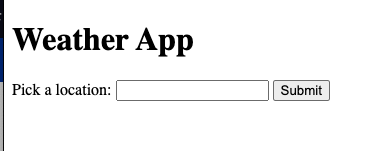
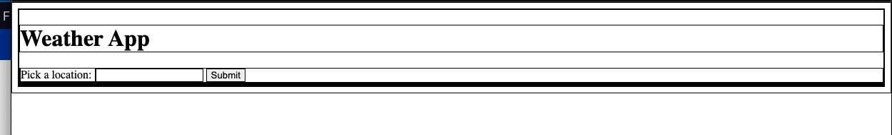
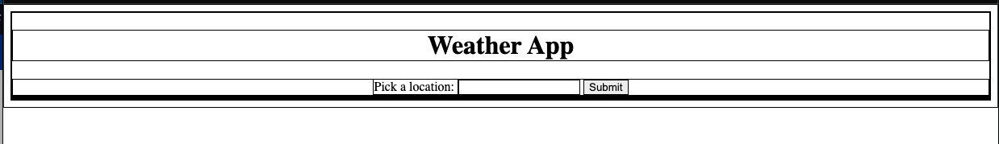
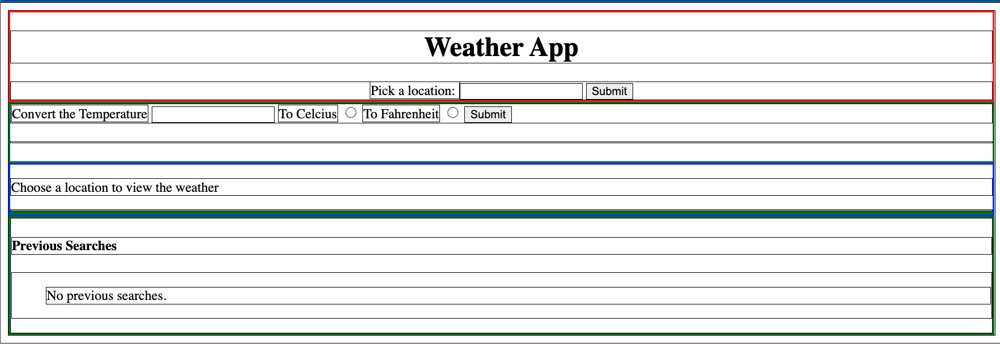

# Weather App Project Helper Instructions

## Introduction

When you are working on the Weather App project, you may find it helpful to use the following instructions to help you get started. These instructions are not required, but they may help you get started on the project.

After talking with some instructors mostly Colin, Raz and Anthony, they agreed with me about the Single Responsibility Principle [SRP](https://www.freecodecamp.org/news/solid-principles-single-responsibility-principle-explained). Although this concept _I believe_ is not taught in the curriculum, it is a good practice to follow. The SRP states that a function should do one thing and one thing only. This is a good practice to follow because it makes your code more readable and easier to debug.

The reason I mention this is because that's how I approached the project. I will try to explain as much as possible of my thought process. As possible. I will dive into CSS only a little bit, but I will try to explain the JavaScript as much as possible. Let's begin!

## HTML

The HTML I thought was the tricky part and the tests were not very helpful. I had to look inside the tests to see how exactly they wanted it structured. I think this was the big chunck of my delay with this project. I want some of you to avoid it and maybe that can help you focus more on the JavaScript.

The image below is how they want thelanding page to look like. When I see layouts like this my mind immediatlly thinks of boxes, wrappers, containers, squares and coincidently CSS Grid is what they require from us.


When we first open the project our index.html file will be empty, meaning we really gotta do this from scratch. Thankfully VSCode has a great feature that will help us with this. If you type `html:5` and press `tab` it will generate the basic structure for you. This is what I did and I will show you how I structured it.

```html
<!DOCTYPE html>
<html lang="en">
  <head>
    <meta charset="UTF-8" />
    <meta http-equiv="X-UA-Compatible" content="IE=edge" />
    <meta name="viewport" content="width=device-width, initial-scale=1.0" />
    <title>Weather App Project</title>
  </head>
  <body>
    <!-- empty body -->
  </body>
</html>
```

The code above will give us the foundation of our project. Continuing forward I will exclude the code above and only show the code inside 'body'.

## Landing Page

Now the instructions for the landing page are as follows:

- [x] There is a header that includes
  - [x] The application's title
  - [x] a search form with a label, text input, and submit input

There are many ways to accomplish the same structure below. I don't want ya'll to think my way is the right way. Because it is not. Figure out your own way.

```html
<header>
  <h1>Weather App</h1>
  <form id="form">
    <label for="submit">Pick a location: </label>
    <input type="text" id="submit" name="submit" autocomplete="off" />
    <input type="submit" form="form" value="Submit" />
  </form>
</header>
```

After you've added that code to your index.html file, you should see something like this:



I've added the code below on a separate css stylesheet.

```css
* {
  border: 1px solid black;
}
```

I've linked the stylesheet to my index.html file like this:

```html
<!DOCTYPE html>
<html lang="en">
  <head>
    <meta charset="UTF-8" />
    <meta http-equiv="X-UA-Compatible" content="IE=edge" />
    <meta name="viewport" content="width=device-width, initial-scale=1.0" />

    <!-- look below -->
    <link rel="stylesheet" href="style.css" />
    <!-- look above -->

    <title>Weather App Project</title>
  </head>
  <body>
    <header>
      <h1>Weather App</h1>

      <form id="form">
        <label for="submit">Pick a location: </label>
        <input type="text" id="submit" name="submit" autocomplete="off" />
        <input type="submit" form="form" value="Submit" />
      </form>
    </header>
  </body>
</html>
```

## How I look at HTML and CSS

After the stylesheet is applied it would look something like this. I show you this because that's how it was showed to me once and that's how I see html and css ever since.



Since the header is the one holding both the h1 element and the form element. Let's use text-align and maybe we can center the elements within the header element.

## CSS

```css
header {
  text-align: center;
}
```

Yup IT WORKED!!


## ASIDE element

This is just a simple element

- [x] `aside` (will contain a temperature conversion widget), starts empty

```html
<aside>
  <form>
    <label for="temp">Convert the Temperature</label>
    <input type="number" name="temp" />

    <label for="temp_c">To Celcius</label>
    <input type="radio" name="temp_c" id="to-c" value="c" />

    <label for="temp_f">To Fahrenheit</label>
    <input type="radio" name="temp_f" id="to-f" value="f" />

    <input type="submit" value="Submit" />
  </form>
  <h4></h4>
</aside>
```

## Main Section

- [x] The `main `section of the page contains placeholder text and contain the following elements:
  - [x] `article` - this will contain the current weather (starts empty)
  - [x] `aside` - this will contain 3 `article` elements that will have upcoming weather (starts empty)

```html
<main>
  <p>Choose a location to view the weather</p>
  <article></article>
  <aside></aside>
</main>
```

## Search History

- [x] `aside` (will contain weather history)
  - [x] `section`
  - [x] `h4` with the text `Previous Searches`
- [x] The sidebar includes an empty `ul` and a message inside a `p` element that lets the user know no searches have been made yet

```html
<aside>
  <section>
    <h4>Previous Searches</h4>
    <ul>
      <p>No previous searches.</p>
    </ul>
  </section>
</aside>
```

## Finally after following the instructions your html should look like this:

```html
<!DOCTYPE html>
<html lang="en">
  <head>
    <meta charset="UTF-8" />
    <meta http-equiv="X-UA-Compatible" content="IE=edge" />
    <meta name="viewport" content="width=device-width, initial-scale=1.0" />
    <link rel="stylesheet" href="style.css" />
    <script defer src="main.js"></script>
    <title>Weather App Project</title>
  </head>
  <body>
    <header>
      <h1>Weather App</h1>

      <form id="form">
        <label for="submit">Pick a location: </label>
        <input type="text" id="submit" name="submit" autocomplete="off" />
        <input type="submit" form="form" value="Submit" />
      </form>
    </header>

    <aside class="hidden">
      <form>
        <label for="temp">Convert the Temperature</label>
        <input type="number" name="temp" />

        <label for="temp_c">To Celcius</label>
        <input type="radio" name="temp_c" id="to-c" value="c" />

        <label for="temp_f">To Fahrenheit</label>
        <input type="radio" name="temp_f" id="to-f" value="f" />

        <input type="submit" value="Submit" />
      </form>
      <h4></h4>
    </aside>

    <main>
      <p>Choose a location to view the weather</p>
      <article></article>
      <aside></aside>
    </main>

    <aside>
      <section>
        <h4>Previous Searches</h4>
        <ul>
          <p>No previous searches.</p>
        </ul>
      </section>
    </aside>
  </body>
</html>
```

### With the code above we should get something like this:



With the code provided above I think you have a pretty solid foundation of how and where to start the project. HTML and CSS are different beasts and it took me months if not years to get somewhat good at it. There are still things to go over like html semantics and css selectors. But that's not part of this project's emphasis.
